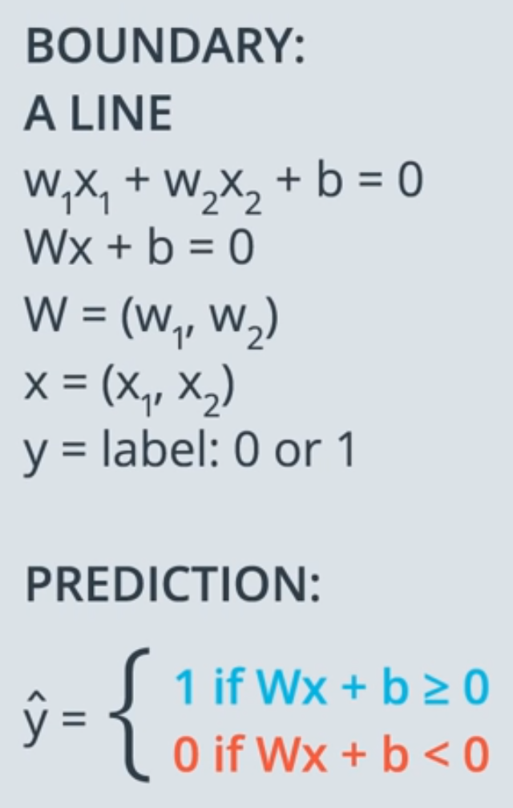

## Part 1 - Introduction to Neural Networks 

### Decision Boundary 

 

### Perceptron
 
  
Moving the line closer to the point by multiply the learning rate with a vector from point (a,b) - [a, b, 1] and subtract or add to the original weights and bias. If misclassified point's prediction is 1, then subtract. Otherwise, add. 

### Perceptron Algorithm 

### Activation Function 
 
 

### Error Function 
* Continuous error functions are better than discrete error functions, when it comes to optimizing. 
* 