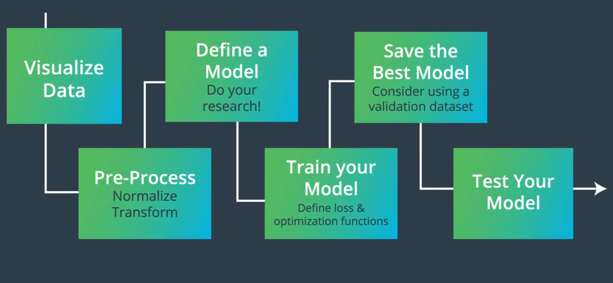
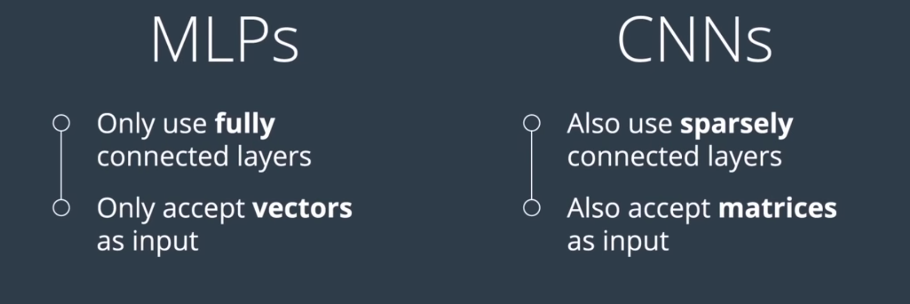
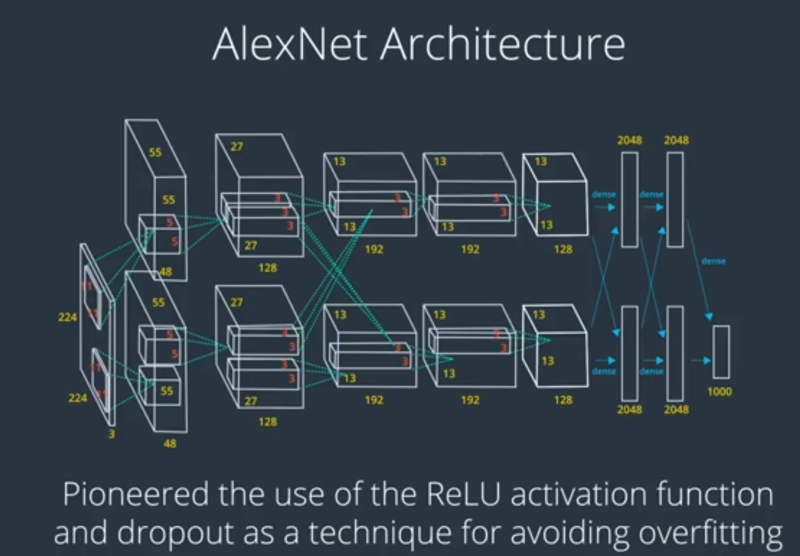
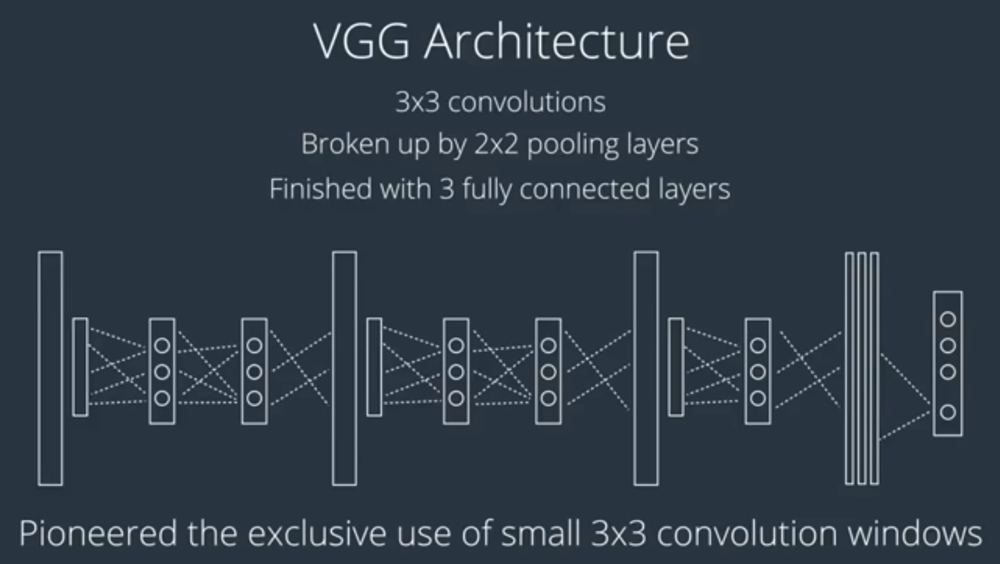
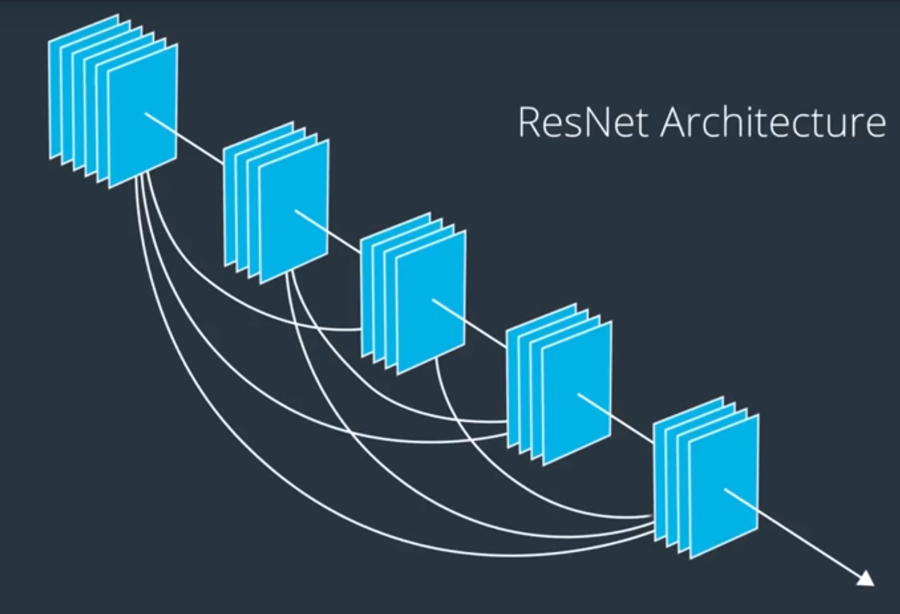

## Lesson 5 - Convolutional Neural Networks  

### Features
- I’ve found that a helpful way to think about what a feature is, is to think about what we are visually drawn to when we first see an object and when we identify different objects.  

### Data Normalization 
- Data normalization is typically done by subtracting the mean (the average of all pixel values) from each pixel, and then dividing the result by the standard deviation of all the pixel values.  
- For image inputs we need the pixel numbers to be positive, so we often choose to scale the data in a normalized range [0,1].  

### Activation Function 
- The purpose of an activation function is to scale the outputs of a layer so that they are a consistent, small value. Much like normalizing input values, this step ensures that our model trains efficiently! 

### Basic Training/Learning Structure 
The steps for training/learning from a batch of data are described in the comments below:

1. Clear the gradients of all optimized variables
2. Forward pass: compute predicted outputs by passing inputs to the model
3. Calculate the loss
4. Backward pass: compute gradient of the loss with respect to model parameters
5. Perform a single optimization step (parameter update)
6. Update average training loss

### Validation Set

We create a validation set to

- Measure how well a model generalizes, during training
- Tell us when to stop training a model; when the validation loss stops decreasing (and especially when the validation loss starts increasing and the training loss is still decreasing)

### Image Classification Steps 
 

### Kernel
- A kernel is a matrix that modifies an image in a way that we can identify boundries, patterns and high-frequency areas. 

### Edge Handling

- Extend: The nearest border pixels are conceptually extended as far as necessary to provide values for the convolution. Corner pixels are extended in 90° wedges. Other edge pixels are extended in lines.

- Padding: The image is padded with a border of 0's, black pixels.

- Crop: Any pixel in the output image which would require values from beyond the edge is skipped. This method can result in the output image being slightly smaller, with the edges having been cropped.

### Pooling
- Average Pooling is typically not used for image classification problems because maxpooling is better at noticing the most important details about edges and other features in an image, but you may see this used in applications for which smoothing an image is preferable.

### MLP vs CNN
 

### Popular Architectures

 
 

